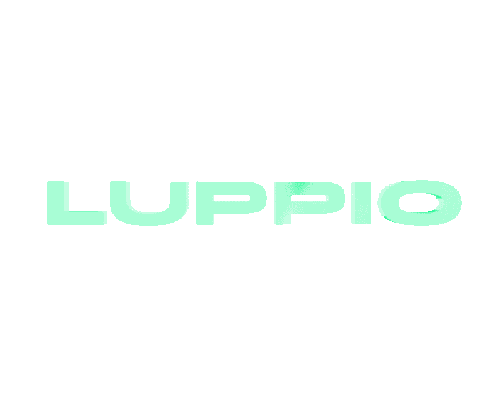

  

# Luppio - botanical rebirth
2021-team-work-group_7 created by GitHub Classroom
Luppio is a virtual experience built on p5.js in which the users can create their own alien plant and escape from their daily life.
The app is playable at [baby]

Luppio was developed as a part of the Creative Coding course at Politecnico di Milano.
Faculty: Michele Mauri, Tommaso Elli, Andrea Benedetti
Team: Giovanni Bonassi, Giuseppe Defilippis, Maria Martinuz, Yuri Piemontese, Antonio Sacchet

## Concept:
Taking care of plants can represent a moment of escape from everyday life. The variety of nature is beautiful but... existing plants, unfortunately, can’t be personalized.
Thanks to Luppio, the experience of owning plants is taken to the next level: users will be able to create their own personalized alien plant. Enchantment will be delivered through a visual and interactive experience that will make people forget their daily struggles for a few moments.
 
## Context of use
The creative process of the plant is personal and intimate. The user accesses the website via computer and lives a relaxing experience far from the frenetic world.
After the satisfying creation of the plant, the user can plant it in the garden (3D archive) and share it with their friends through an image.

## Website storytelling

It’s 2050. Earth imploded due to global warming. The inhabitants must escape on another planet, Luppio, that however is still not ready to be livable: to survive, it’s necessary that each person has a plant always with them. Each family of plants guarantees people oxygen, water or nourishment.

## Structure

## 1. Home
A voice assistant drives the user during the website journey and contributes to the creation of a cohesive narrative for the whole experience. By scrolling down the user is introduced into Luppio atmosphere, where he can discover the causes of the exodus from the earth.

## 2. Family Choice
In this page the user can choose his own family plant. Each family has a different class of elements that allow human survival: 

- Triximos: provides nourishment
- Frillyu: provides oxygen 
- Sukulaas: provides water

The user can choose the one he feels most connected to. 
The 3D plants are made with WebGL and the easycam library.

## 3. Camera Scanning
In this page, two more elements will be assigned to the user’s plant. The interaction starts with a button that enables access to the webcam. The canvas slides on the right, leaving space for the webcam. The face scanner recognizes the total amount of brightness and general color tone in the space and assigns two different variations of elements.

## 4. Alter the elements
in this page the user is able to modify and personalize their own plant. This page is divided into three steps. These interactions always start with a button that enables access to the microphone or the webcam. Then, another button appears in order to fix the scale of the elements.
###### a. Shout - Voice recognition
A button enables the microphone detection and asks the user to scream: with a voice analyser, an element of the plant changes in its size. When the user is happy about the appearance, they have to press the button “fix scale”, that stores the data. After completing these steps a “next” button takes the user to the next interaction.
###### b. Move - Hands tracking
In the second step the user enables the webcam and a hand detection library (hands.js) to recognize the hand and detect the y value of the index finger. Through that, another element's size changes. 
###### c. Blow - Voice recognition
The last way to alter the elements is the voice again, but in this case the user will be asked to blow in the microfone to modify the designated part. At the end of this interaction the last “next” button will open the last personalization page.

## 5. Name and Color
The alien plant experience is coming to an end: in this page the user has to give a name to their creation. Besides this, in the middle of the screen there is the finished plant with a vertical background, whose color can be changed with a second button. The last button, “take a picture” will in fact save an image of the plant so that people can share it with their phones; this was thought specifically in relation to Instagram stories. This button will also upload the plant in the firebase realtime database and will take you to the last page. 

## 6. Archive
The archive stores every plant submitted by the users by placing them in line with the given name at the bottom. By scrolling with the mouse or pressing the arrows on the keyboard, users can navigate the plants already created, see what the other inhabitants of the planet have chosen and feel like a part of the Luppio community.

## 7. Loading page
SInce the website requires a few seconds to fully load, there is a screen with a green background and a 3d animation of Luppio’s logo that catches the eye and gives an idea of the visuals of the website.

## Tools
- TweenMax
- 3D JS
- EasyCam
- WebGL
- hands.js
- speech.js
- sound.js
- scrollmagic
- GSAP

- Firebase

## Coding challenges
Archive

